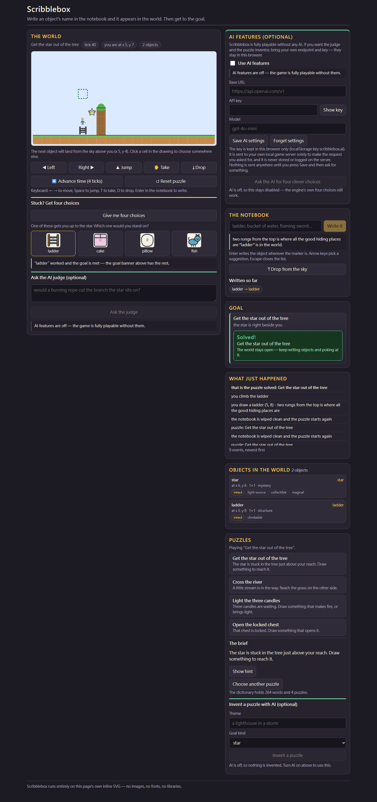

# Scribblebox

A small Scribblenauts-style puzzle game: **type an object's name into the notebook and it appears**
in the world. Objects behave like themselves — a ladder can be climbed, a match starts a fire, a rope
can be cut, a battery powers a machine — and each puzzle can be won in many different ways.

Everything runs offline in one Docker stack: Go service, vanilla-JS frontend, no build step, no
external assets, no model, no API key required. The AI features (a judge and a puzzle generator) are
**optional**, bring-your-own-endpoint.



**A recorded session:** [`docs/scribblebox-demo.mp4`](docs/scribblebox-demo.mp4) — 5 minutes 40 of real
play against the live stack: the notebook and adjectives, an improvised word, fire and ice, the
four-choice hint, all four puzzles, and then the optional AI part (a real endpoint, a real key: the
settings, a connection test, AI four choices, the judge's verdict, and a puzzle the model invented and
the engine accepted). A scene-by-scene plan for performing it live is in
[`docs/DEMO_SCRIPT.md`](docs/DEMO_SCRIPT.md); the scripts that record both parts are
[`docs/record-demo.js`](docs/record-demo.js) and [`docs/record-ai-segment.js`](docs/record-ai-segment.js).

---

## Quick start

```bash
docker compose up -d --build
# the game:   http://localhost:3003
```

Two containers, both bound to loopback only:

| Service | Port | What it is |
|---|---|---|
| `frontend` | `127.0.0.1:3003` | Nginx serving the page and proxying `/api/` |
| `backend` | `127.0.0.1:8083` | The Go service (world engine, dictionary, optional AI proxy) |

Ports 3000/3001/8080 were already taken on this machine by other projects, so Scribblebox publishes
3003/8083 instead. Change them in `docker-compose.yml` if you prefer others — and if you move the
frontend port, add it to the backend's `ALLOWED_ORIGINS` (a test in `backend/main_test.go` checks this
against `docker-compose.yml` so the two can never silently disagree).

Without Docker:

```bash
cd backend && go run .        # service on :8080
cd frontend && python -m http.server 3003   # then open http://localhost:3003
```

## The game

**Four puzzles, all deliberately easy** (aimed at a primary-school pupil, solvable on the first or
second try), each winnable in many ways:

| Puzzle | Goal | Some of the ways to win |
|---|---|---|
| **The star in the tree** | Reach the star stuck in the tree | ladder, rope, a stack of boxes, a jetpack, a trampoline, a grappling hook |
| **Cross the river** | Get to the grass on the far bank | bridge, boat, raft, plank, freezing the water into ice, a jetpack |
| **Light the three candles** | Every candle alight | match, lighter, torch, a candle, a campfire, a flamethrower |
| **Open the locked chest** | Open the chest | key, crowbar, hammer, drill, magic wand, dynamite |

**What objects can do.** The dictionary holds **284 nouns**, each with properties (*tags*): flammable,
fire, light-source, cold, frozen, sharp, cutting, climbable, platform, solid, rope, buoyant, heavy,
fragile, conductive, power-source, machine, lift, unlock, explosive, edible, container, collectible,
wheeled, magical, animal, plant, person, and a few more. The engine acts on them:

- **Gravity and stacking** — objects fall and rest on each other, so boxes build a tower; heavy things
  crush fragile ones underneath.
- **Water** — buoyant objects float, heavy ones sink, and anything **cold or frozen turns water into
  walkable ice** (that is how you freeze the stream).
- **Fire** — flames spread to flammable neighbours, burning things turn to ash, and water puts a fire
  out.
- **Cutting, unlocking, explosions** — a knife cuts a rope (which then stops holding anything up), a
  key opens a locked container, dynamite next to a flame blows a chest open and levels what is nearby.
- **Power** — a battery next to a wire next to a machine powers it; a powered lift rises.
- **Climbing and moving** — walk, jump, climb ladders and ropes, pick a small object up, drop it.

**Adjectives work.** Put a modifier in front of the noun and the object changes: `big flaming ladder`,
`metal rope`, `frozen water`, `giant stone box`. 51 modifiers change size, mass, material and state,
and they merge with the object's own properties instead of replacing them.

**No word is ever refused.** Type something the book has never heard of — `zorble`, `big zorble`,
`flaming zorble` — and it improvises a stable object (the same word always gives the same thing), says
so, and lets you play with it.

## The four-choice hint (the game's own help)

Press **Give me four choices** and you get exactly four objects to pick from, **exactly one of which
really solves the puzzle** — and that is not a claim, it is checked by simulation:

- Every candidate is **dry-run in a sandbox copy** of the world before it is offered. The one that
  solves the puzzle stays; three that provably do not are kept as decoys.
- The correct option is **never marked** in the response or the page. You find out by pressing it.
- The promise is re-proved **when you press** a choice, at a spot verified for the world as it stands
  right now — if the old spot has filled up, the engine says so and offers four fresh choices.
- If the engine cannot stand behind four choices (nothing can be verified, or the puzzle is already
  solved) it **says that instead of inventing a hint**, and offers Reset.

Three tests hold this down: `TestHintOffersFourVerifiedOptionsForEveryPuzzle` in the world package
plays all four options and requires exactly one win, `TestTheFourChoiceHintIsVerifiedEndToEnd` does the
same through HTTP, and `TestChoosingAHintOptionIsVerifiedWhenItIsPressed` changes the world between
offering and pressing — the case that used to break the promise.

## Optional AI features (bring your own endpoint)

Both are off by default. Open **AI features (optional)** in the sidebar, tick *Use AI features*, and
enter your own **base URL, key and model** (any OpenAI-compatible `/chat/completions` endpoint).

| Feature | Endpoint | What it does |
|---|---|---|
| **AI judge** | `POST /api/ai/judge` | You describe an idea in your own words ("I lean a ladder on the tree — does that count?"); the model rules on it with a short reason. An approval is recorded by the engine as an accepted solution. |
| **AI puzzle** | `POST /api/ai/puzzles` | Asks for a new puzzle in a theme you choose, one of the four goal kinds. The engine **validates and can refuse** it (see below) before you ever play it. |
| **AI four choices** | `POST /api/ai/hint` | The model suggests the four objects; the engine then simulates every one, so exactly one still really works — whatever the model said. |
| **Test connection** | `POST /api/ai/ping` | Proves the settings work before you rely on them. |

**Where the key lives.** In your browser, under one `localStorage` key (`scribblebox.ai`), and nowhere
else. It is sent to your own local game service only to make the request, is never written to disk on
the server, never logged, and never echoed back. Nothing is sent anywhere until you press Save and then
ask for something. `Forgot settings` clears it.

**What the AI may not do.** A generated puzzle is only accepted if the engine can referee it: one of the
four goal kinds, terrain codes that exist, the player start inside the grid and not inside a wall, the
goal object present, **within 12 cells of the player**, at most 25 entities, water at most 4 wide. A
puzzle that is too big, too far or otherwise unrunnable is rejected with a friendly reason
(`the AI's puzzle was rejected: this puzzle would be too hard for the game's difficulty: …`) rather
than played. If the endpoint answers with prose instead of JSON, refuses the key, times out or is
unreachable, the UI says exactly that — it never invents a result.

**A refused puzzle gets one chance to be fixed.** The engine knows precisely what was wrong, so its
complaint is handed straight back to the model, which is asked to correct only that and return the
whole spec again. It usually works — the generated puzzle in the recorded demo arrived that way — and
when it does, the response says `"repaired": true` so nobody has to guess. If the second attempt is
still unplayable, the player is told why instead of being handed a broken puzzle.

**Pointing at a service on this machine.** The AI call is made by the **backend container**, so
`127.0.0.1` there means the container, not your PC. Use
`http://host.docker.internal:3000/v1` for a local gateway (for example the `new-api` instance on port
3000), or `http://127.0.0.1:3000/v1` when you run the backend with `go run` instead of Docker.

## The drawing

Every object in the world is **inline SVG drawn in the page**, from one shared shape map of twenty
shapes (`box, ladder, rope, plank, blob, circle, star, tree, flame, key, tool, animal, person, bottle,
book, vehicle, chest, candle, flag, machine`) with an unknown shape falling back to `blob`. No images,
no fonts, no icon library, no CDN — the page loads nothing from anywhere. Drawing is deterministic (no
`Math.random`, no `Date.now`): the same state always renders the same picture, which is also what lets
the tests assert on `g[data-key="ladder"]` instead of pixels.

## Tests

```bash
cd backend  && go test -race -count=1 ./...      # 139 tests, five packages
cd frontend && npm test                          # 252 checks over the page, the JS and the config
cd frontend && APP_URL=http://localhost:3003 npm run test:e2e   # 20 Playwright specs
```

| Package | Tests | What it covers |
|---|---|---|
| `backend/lexicon` | 38 | Every authored noun, the modifier system, improvised words, autocomplete |
| `backend/world` | 59 | Physics rules, all 32 authored solutions, spec validation, the four-choice hint |
| `backend/ai` | 16 | The OpenAI-compatible client: wire format, honest error kinds, JSON extraction, the repair round |
| `backend/api` | 22 | The HTTP contract, CORS, bounds, sandboxing of generated puzzles, the repair round |
| `backend` (main) | 4 | Ports, timeouts, and the CORS/Compose consistency guard |
| `frontend` | 252 + 20 | Ids and shape map, the AI panel and key hygiene, live and mocked browser flows |

The browser specs run against the real stack (`APP_URL=http://localhost:3003 npm run test:e2e`); the
mocked ones run anywhere, with `/api/**` intercepted in Playwright.

## API

| Method | Path | Body / notes |
|---|---|---|
| `GET` | `/api/health` | `{"status":"ok","words":284,"puzzles":4}` |
| `GET` | `/api/puzzles` | The four puzzles. **Never carries an answer key** |
| `GET` | `/api/words?q=lad&limit=8` | Autocomplete, plus the `shape`/`color` of an exact match |
| `POST` | `/api/worlds` | `{"puzzleId":"star-in-tree"}` or `{"aiSpec":{…}}` |
| `GET` | `/api/worlds/{id}` | The state the page renders |
| `POST` | `/api/worlds/{id}/spawn` | `{"phrase":"big flaming ladder","x":6,"y":3}` |
| `POST` | `/api/worlds/{id}/step` | `{"ticks":4}` — let time pass |
| `POST` | `/api/worlds/{id}/act` | `{"action":"left"\|"right"\|"jump"\|"take"\|"drop"}` |
| `POST` | `/api/worlds/{id}/reset` | Back to the starting position |
| `POST` | `/api/worlds/{id}/hint` | The four verified choices |
| `POST` | `/api/worlds/{id}/hint/choose` | `{"phrase":"ladder"}` — placed at a spot verified now |
| `POST` | `/api/ai/judge` | settings + `{"worldId","question"}` |
| `POST` | `/api/ai/puzzles` | settings + `{"theme","goalKind"}` |
| `POST` | `/api/ai/hint` | settings + `{"worldId"}` |
| `POST` | `/api/ai/ping` | settings only — proves the endpoint answers |

`settings` is always `{"baseUrl","apiKey","model","timeoutSeconds"}` and is per request. Origins
outside the allowlist get `403`; worlds are bounded (500 in memory, oldest evicted first) and every
mutation endpoint is POST-only.

## Repository layout

```
backend/
  lexicon/   the 284-noun dictionary, modifiers, the improvised-word fallback
  world/     grid, terrain, physics rules, player, the four puzzles, hint verification
  ai/        OpenAI-compatible client, judge, puzzle generation, hint suggestions
  api/       HTTP layer: worlds, hints, AI proxy, CORS, bounds
frontend/    index.html, app.js (SVG world + notebook + panels), styles.css, tests
docs/        notes and screenshots
```

## Honest limits

- The dictionary is finite (284 nouns plus any adjective combination). Improvised words are stable and
  playable but generic — they do not magically gain the right powers.
- The physics is a small rule engine, not a simulation: no momentum, no liquids spreading, no
  destruction beyond the documented rules.
- Puzzles are authored and hand-checked; the four built-in ones are meant to be easy, not deep.
- The AI judge can be wrong about the world (it is a model, not the engine); its approval is recorded
  as a judgement, and the engine's own rules always keep the final say on ordinary play.
- The feedback line for a four-choice press can trail the world by one tick: the page keeps it honest
  by amending itself the moment the goal is met.
